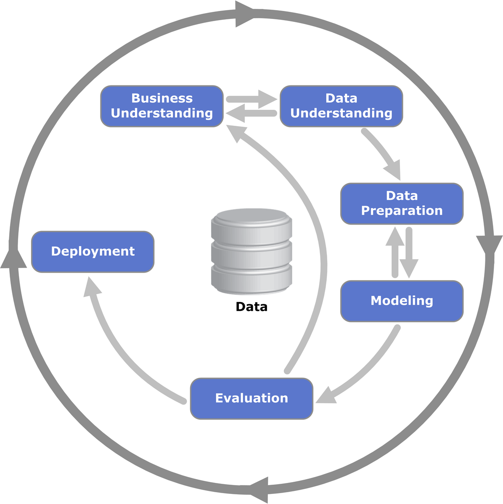
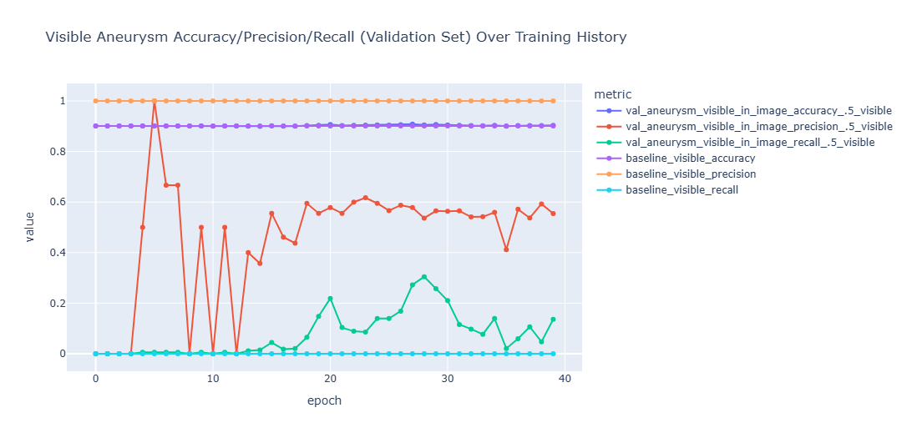

# Aneurysm Detection Capstone: Final Report

### Introduction

This project was inspired by Kaggle's [Intercranial Aneurysm Detection Competition](https://www.kaggle.com/competitions/rsna-intracranial-aneurysm-detection). As this is my first computer vision project ever, I did not end up submitting to the competition. But I learned a ton along the way. In this report, I share all of the progress I have made and next steps - both for this project and in my educational journey.

My code for this project is in the attached Jupyter Notebook: [aneurysm_detection.ipynb](aneurysm_detection.ipynb)

I also created a second notebook for use when training my models on Google Colab: [colab_streamlined_notebook.ipynb](colab_streamlined_notebook.ipynb)

This current repository contains my final class report for this project Please note that my *initial* report/exploratory data analysis is in a [separate repository](https://github.com/kyledunne/mlai-capstone).

### Background

I highly recommend reading the [Clinical Overview](https://www.kaggle.com/competitions/rsna-intracranial-aneurysm-detection/discussion/591648) article written by one of the competition hosts for a deeper dive on what intercranial aneurysms are and where AI/computer vision can serve an important role in helping to identify them, potentially saving lives in the process.

I would like to thank Dr. Carlos Puyo, Niyati Shelat, Yelena Trepetin, and Dr. J Saravana Ganesh for sharing their medical expertise with me and helping to guide this project.

## Overview (CRISP-DM)

Source: Kenneth Jensen, https://commons.wikimedia.org/wiki/File:CRISP-DM_Process_Diagram.png

### Business Understanding

The [Clinical Overview](https://www.kaggle.com/competitions/rsna-intracranial-aneurysm-detection/discussion/591648) article written by one of the competition hosts gives an excellent overview of the importance of this work. To summarize, intercranial aneurysms are extremely dangerous, as when they rupture it is often fatal to the patient, and aneurysms are often not detected until after they rupture. But, if an aneurysm is detected before it ruptures, it can often be treated with a minimally invasive procedure.

A powerful machine learning algorithm that could identify aneurysms from medical images - potentially with superhuman performance, i.e., more reliably than trained radiologists - could help save lives. To be more concrete, many medical images of the brain are taken for patients for a variety of reasons, and aneurysms are often found incidentally - i.e., the medical images were taken for a different reason and the doctor was not looking for an aneurysm, but finds one when they look at the images.

Slotting in a machine learning algorithm that could be used in hospitals to automatically scan medical images of the brain for aneurysms could dramatically increase how often aneurysms are caught. The algorithm does not necessarily need to be better than humans at identifying aneurysms to add value - a doctor is more likely to catch an aneurysm from an image when they are specifically looking for it, while an automated algorithm could scan a long series of medical images without any fatigue, highlighting suspect images for further investigation by a doctor.

### Data Understanding

For the competition, we are presented with a large dataset of medical images of over 4,000 patients, as well as some metadata for the images. This dataset contains two folders: `series` and `segmentations`, and two tables, `train.csv` and `train_localizers.csv`. Below, I go through these four items and describe their importance.

- `series`: This is the main folder containing all of the patient images. The `series` folder contains a subfolder for each patient; each of these subfolders contains a series of DICOM images (DICOM is a standard medical imaging format) of that patient's brain - all taken during a single session. That is to say, the images come from many different dates and times, but for each individual patient, all of their images are from the same day. Generally, medical images take a series of frames of images - think of them as different "slices" of the brain - and then combine them into a series tagged with metadata of when and where each image was taken. Note that DICOM image files can either be single-frame or multi-frame - that is to say, some images have a long series of single-frame DICOM files, while other patients may have only a single DICOM file but it is a multi-frame DICOM. Both of these formats are *functionally* the same, it just adds a bit of extra complication in data preparation. (Please note that this folder is excluded from this repository due to its very large size - well over 200 GB and over 1 million individual files)

- `segmentations`: This is a supplementary folder - not fully necessary for the project - which contains a number of NifTI files. NifTI files are a 3d medical imaging format - essentially they take the "slices" of DICOM images and organize them into a 3d representation. This can be viewed through a NifTI file viewer, and there is a good free one offered by the University of Michigan at this link: https://socr.umich.edu/HTML5/BrainViewer/. I have excluded the segmenations folder from this repository due to the large file sizes, but I included one of the files as [nifti_example.nii](nifti_example.nii). To get a better idea of what NifTI files are like, you can upload that file to the UMich Brain Viewer and play around with it. The provided NifTI files correspond to a subset of the patients in the `series` folder, and contain image segmentations of those patient's brains. I do not use this file in my project as I am only doing basic image classification and have not yet ventured into object detection or image segmentation. However, when I revisit this project later that may change.

- `train.csv`: This is the main table that contains the information about the 4,348 patients in the dataset. Each row corresponds to one patient, and contains a SeriesInstanceUID, which corresponds to one of the subfolders in the `series` folder. Each row also contains some very basic demographic data about each patient: their age and their sex. We are not given any additional data about any of the patients in the dataset, which means that from a data perspective, we are working almost entirely with the images alone. Each row also contains the modality of the imaging of that patient: either MRA, CTA, MRI T1, or MRI T2post. The [Clinical Overview](https://www.kaggle.com/competitions/rsna-intracranial-aneurysm-detection/discussion/591648) article goes into more detail about the differences between these various kinds of imaging modalities. However, the upshot is that they are all greyscale image modalities, and I received advice from Dr. Ganesh that the differences are probably not too important for our model-building process. The competition - and the nature of the real-world problem - encourages us to build a model that can generalize over a variety of different kinds of imaging techniques. In addition, images taken using the same modality but from a different machine built by a different manufacturer can look quite different. So for the data understanding, we are largely going to just try to treat all of these imaging modalities the same way, to try to build a model that can generalize well, including to images taken from machines not in the dataset.

Finally, each row of `train.csv` also contains information on whether that patient has an aneurysm, and whether an aneurysm is present in any of 13 different regions of the brain:

- `Right Infraclinoid Internal Carotid Artery`
- `Left Supraclinoid Internal Carotid Artery`
- `Right Supraclinoid Internal Carotid Artery`
- `Left Middle Cerebral Artery`
- `Right Middle Cerebral Artery`
- `Anterior Communicating Artery`
- `Left Anterior Cerebral Artery`
- `Right Anterior Cerebral Artery`
- `Left Posterior Communicating Artery`
- `Right Posterior Communicating Artery`
- `Basilar Tip`
- `Other Posterior Circulation`

Note that some patients have multiple aneurysms, so may have a `1` in multiple different columns, indicating multiple aneurysms present in different locations of the brain.

- Finally, `train_localizers.csv` contains information about the specific images - or frames - in which an aneurysm is present. This is very important, because most patients have hundreds of image frames, yet only one or a few of those frames actually shows an aneurysm. This means there are essentially 3 main important categories of images:

- "Control" images: images from a healthy brain (or at least a brain with no aneurysm(s) present)
- Images without an aneurysm but in a brain with an aneurysm
- Images with an aneurysm

With `train_localizers`, we can sort all training images into one of these three classes. This will be very important for when we move onto the data preparation and modeling stages.

`train_localizers` also provides coordinates (within a specific image) and the brain region of each identified aneurysm. This could prove valuable for object detection or image segmentation approaches.

### Data Preparation

Before beginning data preparation, I think we actually need a prior step, something like "modelling strategy". The dataset is rich and as I progressed through this project, I found it really became a rabbit hole - there are a wide variety of sophisticated techniques one could employ to best use the data and build the strongest model possible.

However, this is my first computer vision project ever. I had dreams of making a competitive entry to this competition by the deadline in mid-October, but it quickly became apparent that that was far too ambitious. I think that crafting a competitive entry to this competition would require at least a month or two of work from an experienced team, and I am just one person learning as I go. Nevertheless, I really enjoyed this project, it was just a lot - so to make the scope manageable, I decided on the following strategic plan:

- Rather than using all images in the dataset to train/validate my model, I decided on using 5 images (randomly chosen) from each patient. This dramatically reduces the size of the dataset because most patients have dozens or hundreds of images (all told this reduces the dataset size from about 300 GB to about 20 GB, allowing me to train my models using an A100 GPU on Google Colab). I chose the number 5 because there are no patients with more than 5 images that contain an aneurysm. So, to select the 5 images for each patient, I first selected all images that contain an aneurysm, and then filled out the 5 images with a random sampling of the remaining images. This lead to about 20,000 total images, about 2,000 of which were images with an aneurysm.
- Instead of using an object detection or image segmentation approach (which I just have not learned yet), I decided to stick with basic image classification.

With these criteria in place, the project became manageable, both from a data preparation perspective and from a model buidling/training perspective.

Once I had all of the images selected, I loaded them into memory using the `pydicom` library, which is the standard for handling DICOM medical images. The images are in a variety of sizes, so I performed scaling and padding to standardize all of the image files to the same size, which I chose (somewhat arbitrarily) to be 512 x 512. I chose this size because I noticed that a fair few of the images were already in this size, and I thought it was important to not make the images much smaller, because aneurysms are small, and reducing the images too much might make it harder to identify aneurysms. I also rescaled all of the pixel values to between 0 and 1.

I split the data into a training and validation set, making sure to stratify using the target value to ensure that the training and validation set had the same proportion of images with and without aneurysms.

I then loaded the data into a tensorflow tensor for fast processing by a deep neural network.

For a more in-depth description of my data preparation process, please consult the [Jupyter Notebook](aneurysm_detection.ipynb).

### Modeling

In my initial report and initial round of modeling, I created a simple convolutional network using Tensorflow/Keras that performed binary classification on my prepared images, predicting either a 1 (aneurysm present) or 0 (aneurysm absent). After a discussion with Dr. Puyo, Niyati, and Yelena, they encouraged trying to additionally predict an alternative target, which I have called in_brain_with_aneurysm. This is a binary classification target which is not mutually exclusive with the original target (which I now call aneurysm_visible_in_image). Dr. Puyo and Niyati had suggested that it may be possible to detect brains that likely have an aneurysm - or maybe are just at risk of an aneurysm - using images from brains that are affected by an aneurysm but in some other region of the brain not visible in the image. This is because aneurysms are sometimes correlated with various other kinds of health issues. In particular, an aneurysm is generally the product of weakened arterial linings. This (or some other potential correlates) may be subtly visible throughout the brain even if an aneurysm is not visible.

In this stage of modeling, I created a CNN with a 2-node Dense sigmoid output layer, to account for the two non-mutually exclusive binary classification targets. Results were mixed initially, and I decided it might be a better idea to train an entirely separate neural network for each task, allowing me to optimize the network architecture for each separate binary classification task individually.

*Below: results of my initial test using the same model to predict both `in_brain_with_aneurysm` and `aneurysm_visible_in_image`. Note that the recall score for `aneurysm_visible_in_image` - very important in this context, because we really don't want false negatives - peaks at about 30%, far lower than the 78% peak in my initial experiment.*

This hunch that two separate neural networks would be a better idea received strong support in my experiments. I used KerasTuner using the [Hyperband](https://keras.io/keras_tuner/api/tuners/hyperband/) algorithm to select hyperparameters for my neural network (training this took many hours). What I found is that running the Hyperband tuner on my network trained to predict the aneurysm_visible_in_image target found a particular set of strong hyperparameters, while running the Hyperband tuner on my network trained to predict the in_brain_with_aneurysm target found that quite a different set of hyperparameters was optimal (or at least close to optimal given my limited configuration/computational resources/time etc.)

I also found substantially lower validation loss values on these new experiments than I found for my dual-purpose model.

### Evaluation

I put a *lot* of work in this project, and I learned a *ton*. But I didn't realize just how ambitious the project I was taking on at the start was. I lost interest in really continuing to work on the project at some point because I just felt I wanted to focus more on my education rather than trying to do a great job on this project when there is still so much left for me to learn. So the project is definitely pretty unfinished, and I am sure I won't get a great grade for the amount of polish that went into the final report. But this project left me really excited to learn more and continue down this path. The work I did here felt a lot more exciting to me than most of the work in traditional machine learning techniques that we learned in this course. To continue my education, I signed up for a series of courses offered by OpenCV University (OpenCV is one of the popular python computer vision libraries, as you are probably aware) - these courses include Fundamentals of Computer Vision & Image Processing in Python, Deep Learning with PyTorch, Deep Learning with Tensorflow and Keras, and Advanced Vision Applications with Deep Learning and Transformers, among others.

I may revisit this project a few months from now, when I have a lot more experience and knowledge of deep learning and computer vision, and see what I am able to come up with then! For now, I am just kind of burnt out because I feel like I am only continuing to work on the project for the grade - and frankly, me gaining the skills I need and not getting burnt out in the process is a lot more important than a grade! But I did want to at least submit something to share the progress I have made and what I have learned.

### Next Steps

My main next step is to really dive in to learning about computer vision! This project was really hard for someone pretty much completely new to the field, and we only covered computer vision very briefly on a very surface level in the course.

But for some concrete next steps, I have many ideas. Here are just a handful of them, and I am sure I will come up with many more over the next few months as I start my new computer vision courses:

- Update the pipeline and model to classify a whole series of images from a single patient (as in the competition), rather than just a single image as a time
- Use all data instead of just a small subset; because the full dataset is so large, this will likely require data parallelism, using a multi-GPU VM from e.g. RunPod.
- Update the pipeline and model to also make predictions for the 13 different regions of the brain (as required by the competition), expanding the problem to predict far more targets.
- Look into using more advanced imaging techniques, such as object detection or even image segmentation, to attempt to improve classification performance (I think the most powerful approach would be to use a pre-existing image segmentation model that is trained on brain images to segment the image, and use that to transform the input data set into a different kind of dataset that only contains specific small regions of the images where an aneurysm could actually be, i.e., parts of the image that contain intersections of major blood vessels, and then train an image classifier on *that*.)
- Look into ensembling, i.e., using multiple different models that perform well but are at the same time as different as possible from each other, and use a weighted sum of their predictions as the final prediction.

